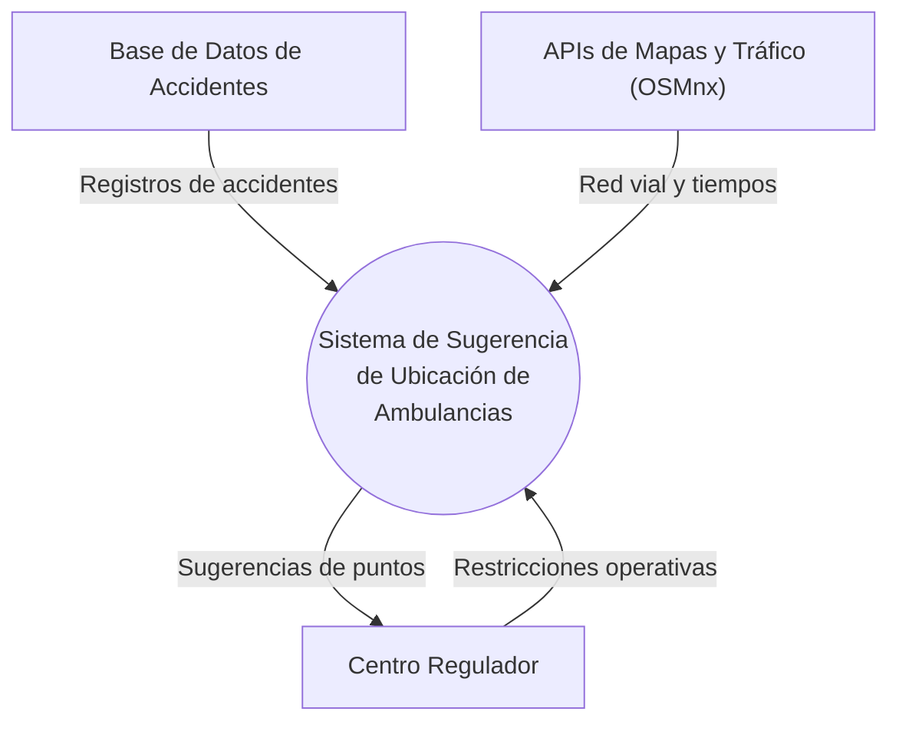

# DFD Nivel 0: Diagrama de Contexto

Este diagrama muestra el sistema en su totalidad y cómo interactúa con las entidades externas.

```mermaid
flowchart TD
    E1["Base de Datos de Accidentes"]
    E2["APIs de Mapas y Tráfico (OSMnx)"]
    E3["Centro Regulador"]

    S1(("Sistema de Sugerencia<br>de Ubicación de<br>Ambulancias"))

    E1 -- "Registros de accidentes" --> S1
    E2 -- "Red vial y tiempos" --> S1
    S1 -- "Sugerencias de puntos" --> E3
    E3 -- "Restricciones operativas" --> S1
```
