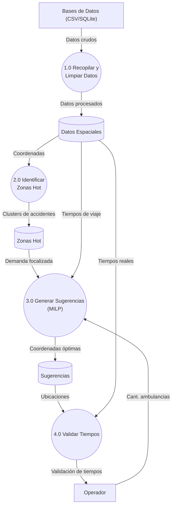

# DFD Nivel 1: Desglose de Procesos Principales

Este diagrama detalla los subprocesos fundamentales del sistema.

```mermaid
flowchart TD
    E1["Bases de Datos (CSV/SQLite)"]
    E2["Operador"]
    
    D1[(Datos Espaciales)]
    D2[(Zonas Hot)]
    D3[(Sugerencias)]

    P1(("1.0 Recopilar y<br>Limpiar Datos"))
    P2(("2.0 Identificar<br>Zonas Hot"))
    P3(("3.0 Generar Sugerencias<br>(MILP)"))
    P4(("4.0 Validar Tiempos"))

    E1 -- "Datos crudos" --> P1
    P1 -- "Datos procesados" --> D1
    
    D1 -- "Coordenadas" --> P2
    P2 -- "Clusters de accidentes" --> D2
    
    D2 -- "Demanda focalizada" --> P3
    D1 -- "Tiempos de viaje" --> P3
    E2 -- "Cant. ambulancias" --> P3
    P3 -- "Coordenadas óptimas" --> D3
    
    D3 -- "Ubicaciones" --> P4
    D1 -- "Tiempos reales" --> P4
    P4 -- "Validación de tiempos" --> E2
```
