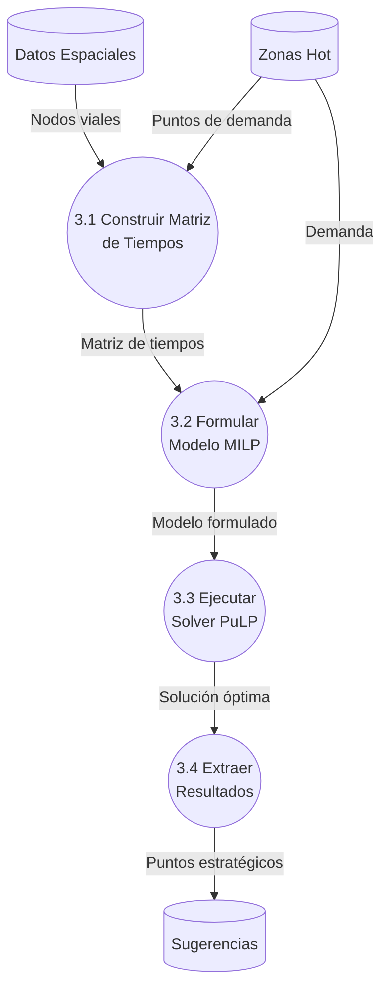

# DFD Nivel 2: Desglose del Proceso 3.0 (Generación de Sugerencias)

Este diagrama detalla cómo funciona internamente el modelo MILP para generar las sugerencias.

```mermaid
flowchart TD
    D2[(Zonas Hot)]
    D1[(Datos Espaciales)]
    D3[(Sugerencias)]

    P31(("3.1 Construir Matriz<br>de Tiempos"))
    P32(("3.2 Formular<br>Modelo MILP"))
    P33(("3.3 Ejecutar<br>Solver PuLP"))
    P34(("3.4 Extraer<br>Resultados"))

    D1 -- "Nodos viales" --> P31
    D2 -- "Puntos de demanda" --> P31
    
    P31 -- "Matriz de tiempos" --> P32
    D2 -- "Demanda" --> P32
    
    P32 -- "Modelo formulado" --> P33
    P33 -- "Solución óptima" --> P34
    
    P34 -- "Puntos estratégicos" --> D3
```
