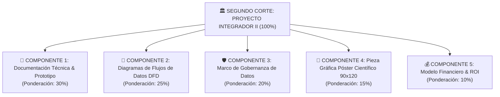

# 📋 Rúbrica Maestra de Evaluación: Segundo Corte (Corte 2)
### Asignatura: Proyecto Integrador II (`Código: 8830 0059 0`)
**Universidad Pontificia Bolivariana — Seccional Montería**  
**Facultad de Ingeniería Industrial // Grupo de Investigación SILOGE // Hub Industrial Solution (HIS)**  
**Docente Titular:** M.Sc. Cristian Javier Cano Mogollón  
**Periodo Académico:** 2026-2 &nbsp;|&nbsp; **Ponderación:** 30% de la Nota Semestral  

---

## 🎯 Estructura de Ponderación de la Tarea

---

## 📄 COMPONENTE 1: Documentación Técnica, Formulación Matemática y Prototipo (30%)
Evalúa el rigor técnico del documento, la formulación analítica de la solución y la integración arquitectónica del prototipo computacional o gemelo digital.

| Criterio | Peso | Excelente (4.5 - 5.0) | Bueno (3.8 - 4.4) | Aceptable (3.0 - 3.7) | Deficiente (1.0 - 2.9) | Insuficiente (0.0 - 0.9) |
| :--- | :---: | :--- | :--- | :--- | :--- | :--- |
| **1.1 Diagnóstico Empírico en Planta (*Gemba Walk*)** | **30%** | Línea base documentada con mediciones en tiempo real en la empresa de Córdoba. Identificación precisa de cuellos de botella y pérdidas operativas. | Buen diagnóstico con datos reales de la empresa, aunque con mediciones agregadas o periodos de observación breves. | Diagnóstico general con escasos datos cuantitativos de la planta. | Diagnóstico meramente teórico sin evidencia de visita o toma de datos empíricos. | No presenta diagnóstico ni contextualización empresarial. |
| **1.2 Formulación Matemática / Algorítmica Formal** | **40%** | Formulación matemática impecable: conjuntos, parámetros con unidades, variables de decisión delimitadas, función objetivo y restricciones bien formalizadas. | Formulación matemática completa y funcional con pequeñas imprecisiones en índices o notación de dominios. | Formulación matemática básica que omite restricciones operativas importantes o presenta función objetivo ambigua. | Formulación matemática inconsistente, con variables no definidas o ecuaciones no resolubles. | No formula modelo matemático ni lógica algorítmica cuantitativa. |
| **1.3 Arquitectura del Prototipo / Gemelo Digital** | **30%** | Diagrama de bloques de integración tecnológica claro (Python, simulación, IA, GUI, BD). Evidencia el estado de avance funcional y módulos operativos. | Buena arquitectura de software y simulación. Prototipo funcional en desarrollo con módulos principales integrados. | Diagrama conceptual genérico. Prototipo en fase muy preliminar con escasa integración técnica. | Arquitectura confusa o desarticulada. Prototipo no funcional o inexistente. | No presenta arquitectura de prototipado ni desarrollo computacional. |

---

## 📐 COMPONENTE 2: Diagramas de Flujos de Datos — DFD (25%)
Evalúa la modelación estructurada de la información en sus diferentes niveles de abstracción bajo notación formal.

| Criterio | Peso | Excelente (4.5 - 5.0) | Bueno (3.8 - 4.4) | Aceptable (3.0 - 3.7) | Deficiente (1.0 - 2.9) | Insuficiente (0.0 - 0.9) |
| :--- | :---: | :--- | :--- | :--- | :--- | :--- |
| **2.1 DFD Nivel 0 (Diagrama de Contexto)** | **30%** | Fronteras del sistema claramente delimitadas. Entidades externas, almacenes y flujos de entrada/salida 100% coherentes y exhaustivos. | Entidades externas y flujos principales bien definidos con leves omisiones en flujos de retroalimentación. | Diagrama de contexto básico que omite entidades externas clave o confunde flujos de control con flujos de datos. | Diagrama incorrecto que viola las reglas básicas de DFD (ej. flujos directos entre entidades externas). | No presenta DFD Nivel 0. |
| **2.2 DFD Nivel 1 (Descomposición Funcional)** | **40%** | Descomposición en procesos primarios (ingesta, depuración, optimización, alertas). Numeración canónica, balance de flujos con Nivel 0 perfecto y almacenes explícitos. | Descomposición funcional clara. Procesos bien identificados con ligeras inconsistencias de balance con el Nivel 0. | Procesos muy genéricos o desbalanceados respecto al diagrama de contexto. | Descomposición desordenada con flujos de datos cruzados erróneos y sin almacenes identificados. | No presenta DFD Nivel 1. |
| **2.3 DFD Nivel 2 (Detalle de Procesos Críticos)** | **30%** | Desglose atómico del proceso analítico principal. Muestra validación de variables, llamadas al motor de optimización y persistencia de resultados. | Buen detalle del proceso analítico central con interacción clara hacia los almacenes de datos. | Detalle superficial que no profundiza en la lógica interna del proceso crítico. | Diagrama incompleto o que confunde DFD con diagrama de flujo de control algorítmico. | No presenta DFD Nivel 2. |

---

## 🛡️ COMPONENTE 3: Marco de Gobernanza de Datos (20%)
Evalúa la formalización de políticas, catálogos, trazabilidad y aseguramiento de la calidad y seguridad de los datos según estándares de la industria (DAMA-DMBOK / ISO 8000).

| Criterio | Peso | Excelente (4.5 - 5.0) | Bueno (3.8 - 4.4) | Aceptable (3.0 - 3.7) | Deficiente (1.0 - 2.9) | Insuficiente (0.0 - 0.9) |
| :--- | :---: | :--- | :--- | :--- | :--- | :--- |
| **3.1 Catálogo y Diccionario de Datos** | **35%** | Diccionario exhaustivo con todos los atributos técnicos: nombre, tipo de dato, longitud, descripción, reglas de validación y fuente de datos. | Diccionario estructurado con la mayoría de atributos clave y descripciones operativas adecuadas. | Diccionario incompleto que solo lista nombres de campos sin metadatos técnicos ni reglas de integridad. | Lista desordenada de variables sin formato de diccionario de datos. | No presenta diccionario ni catálogo de datos. |
| **3.2 Linaje del Dato (*Data Lineage*)** | **35%** | Mapeo gráfico y matricial de la trazabilidad completa del dato desde la captura en planta/sensores hasta la visualización en el dashboard. | Trazabilidad clara en las etapas principales del ciclo de vida del dato con pequeñas lagunas en la fase de transformación. | Linaje descrito solo textualmente sin diagrama de flujo de trazabilidad. | Trazabilidad confusa que no permite rastrear el origen o destino de los datos. | No presenta linaje de datos. |
| **3.3 Dimensiones de Calidad y Políticas de Seguridad** | **30%** | Define métricas objetivas para Completitud, Exactitud y Consistencia. Políticas de seguridad RBAC, cifrado, respaldos y ciclo de vida formalizadas. | Métricas de calidad y políticas de seguridad definidas con buena cobertura práctica para el entorno de la empresa. | Menciona calidad y seguridad de forma teórica sin establecer métricas o controles específicos para el proyecto. | Propuesta de calidad y seguridad vaga o sin relación con la arquitectura del sistema. | Omite totalmente la calidad y seguridad de los datos. |

---

## 🎨 COMPONENTE 4: Pieza Gráfica Institucional — Póster Científico 90x120 cm (15%)
Evalúa la síntesis gráfica de ingeniería, el impacto visual y el uso riguroso de la plantilla y los tres logos institucionales.

| Criterio | Peso | Excelente (4.5 - 5.0) | Bueno (3.8 - 4.4) | Aceptable (3.0 - 3.7) | Deficiente (1.0 - 2.9) | Insuficiente (0.0 - 0.9) |
| :--- | :---: | :--- | :--- | :--- | :--- | :--- |
| **4.1 Parámetros Oficiales y Logos Institucionales** | **50%** | Dimensiones exactas **90 cm $\times$ 120 cm** (vertical). Incluye los logos oficiales de **UPB**, **HIS** y **SILOGE** en alta calidad. Título estructurado según la fórmula canónica. | Cumple dimensiones 90x120 cm. Presenta los tres logotipos oficiales con buena resolución. Título estructurado. | Dimensiones aproximadas o logos con leve distorsión o falta uno de los 3 logos oficiales. | Formato no oficial (ej. apaisado, tamaño no estándar). Falta más de un logotipo. | No entrega póster científico o no utiliza los lineamientos institucionales. |
| **4.2 Integración Visual de DFD, Prototipo y Tarjeta ROI** | **50%** | Diagramas DFD e interfaces nítidos. Tarjeta de KPI financiero (ROI y Payback) visible y destacada. Código QR funcional. Excelente equilibrio visual. | Buena resolución de diagramas e interfaces. Datos de ROI incluidos y código QR funcional. | Diagramas con textos pequeños poco legibles. Métricas financieras poco visibles. QR roto o ausente. | Póster sobrecargado, capturas borrosas o sin datos de retorno financiero. | Presentación deficiente o ininteligible. |

---

## 💰 COMPONENTE 5: Modelo Financiero y Retorno de Inversión — ROI (10%)
Evalúa la solidez cuantitativa del análisis de costo-beneficio del desarrollo implementado.

| Criterio | Peso | Excelente (4.5 - 5.0) | Bueno (3.8 - 4.4) | Aceptable (3.0 - 3.7) | Deficiente (1.0 - 2.9) | Insuficiente (0.0 - 0.9) |
| :--- | :---: | :--- | :--- | :--- | :--- | :--- |
| **5.1 Justificación Financiera, ROI y Payback** | **100%** | Desglose impecable de CAPEX y OPEX. Beneficios operativos respaldados con datos del Gemba Walk. Cálculo formal de ROI anual y Payback en meses coherente y viable. | Buen desglose de CAPEX/OPEX y beneficios cuantificados. Cálculo de ROI y Payback correctos con supuestos razonables. | Estimación financiera básica. Cálculo de ROI presente pero con beneficios sobreestimados o sin justificar el Payback. | Confusión entre costos de inversión y operación. Cálculo matemático erróneo del retorno. | No presenta análisis financiero ni cálculo de ROI. |

---

## 🧮 Matriz de Consolidación Numérica para la Plataforma ZERO

$$\text{Nota Final Corte 2} = (N_1 \times 0.30) + (N_2 \times 0.25) + (N_3 \times 0.20) + (N_4 \times 0.15) + (N_5 \times 0.10)$$

| Equipo | Nota 1: Doc. & Prototipo (30%) | Nota 2: DFD 0, 1, 2 (25%) | Nota 3: Gobernanza (20%) | Nota 4: Póster 90x120 (15%) | Nota 5: ROI (10%) | **Calificación Final Corte 2 (0.0 - 5.0)** |
| :---: | :---: | :---: | :---: | :---: | :---: | :---: |
| **Equipo XX** | $[0.0 - 5.0]$ | $[0.0 - 5.0]$ | $[0.0 - 5.0]$ | $[0.0 - 5.0]$ | $[0.0 - 5.0]$ | **$[0.0 - 5.0]$** |

---
*Facultad de Ingeniería Industrial — Grupo de Investigación SILOGE — Universidad Pontificia Bolivariana Seccional Montería*
