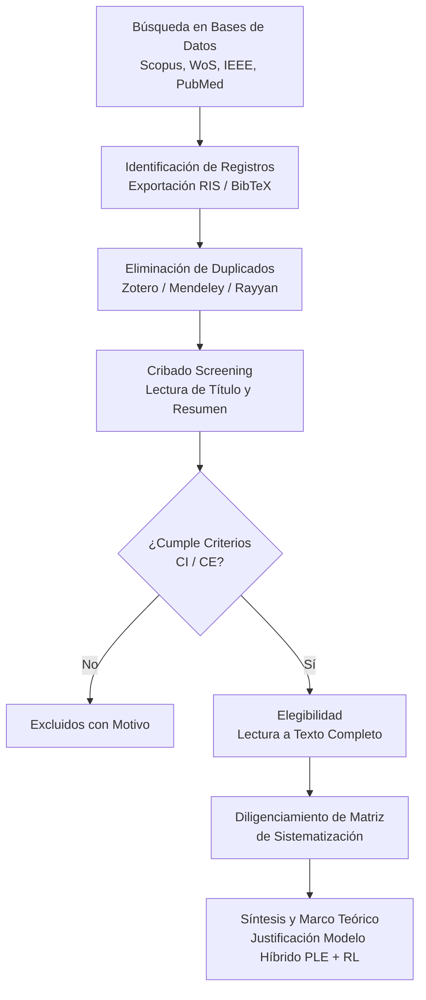

# Guía Metodológica: Búsqueda Sistemática, Ecuaciones Booleanas y Sistematización de la Información

> **Proyecto:** Optimización y Gestión Inteligente del Tiempo de Respuesta en Atención Prehospitalaria de Urgencias en la Ciudad de Montería mediante Programación Lineal Entera y Aprendizaje por Refuerzo.  
> **Documento de Referencia Base:** [Problema.md](file:///c:/Users/pc/OneDrive/Desktop/Proyecto%20integrador%202/Problema/Problema.md)

---

## 1. Contextualización y Alcance de la Búsqueda

El proyecto aborda la problemática de los tiempos de respuesta en el sistema de atención prehospitalaria de Montería debido a asignaciones estáticas (heurísticas FIFO/unidad más cercana), tráfico variable y distribución subóptima de bases de ambulancias. La solución propuesta es un **modelo híbrido** que integra:
1. **Programación Lineal Entera (PLE / MILP):** Para la localización estática óptima de bases y asignación inicial de flota.
2. **Aprendizaje por Refuerzo (RL / DRL):** Para la reubicación dinámica preventiva y enrutamiento adaptativo en tiempo real considerando condiciones estocásticas de tráfico y demanda.

### Ejes Temáticos Clave (Keywords Clusters)

Para garantizar una cobertura integral de la literatura científica, las búsquedas se estructuran en 4 ejes temáticos fundamentales:

| Eje Temático | Conceptos Clave (Español) | Key Concepts (Inglés) |
| :--- | :--- | :--- |
| **Eje 1: Logística de Emergencias y Ambulancias** | Atención prehospitalaria, servicio médico de urgencias, tiempo de respuesta, enrutamiento de ambulancias, despacho de ambulancias. | Emergency Medical Services (EMS), Prehospital care, Ambulance location, Ambulance relocation, Response time, Dynamic dispatching. |
| **Eje 2: Optimización Matemática (Estática)** | Programación lineal entera, programación lineal entera mixta, problema de localización de instalaciones, localización-asignación. | Integer Linear Programming (ILP), Mixed-Integer Linear Programming (MILP), Facility Location Problem (FLP), Location-Allocation models, Maximum Availability Location Problem (MALP). |
| **Eje 3: Inteligencia Artificial y Control Dinámico** | Aprendizaje por refuerzo, aprendizaje por refuerzo profundo, Q-learning, reubicación preventiva, adaptativo a tráfico en tiempo real. | Reinforcement Learning (RL), Deep Reinforcement Learning (DRL), Q-Learning, Markov Decision Process (MDP), Real-time traffic adaptation, Predictive relocation. |
| **Eje 4: Simulación y Entorno Urbano** | Simulación urbana, demanda estocástica, variaciones de tráfico, evaluación de desempleo operativo. | Urban simulation, Stochastic demand, Traffic congestion, SUMO simulation, Agent-based simulation. |

---

## 2. Ecuaciones Booleanas Cerradas (Estrictamente Alineadas a Problema.md)

> [!IMPORTANT]
> **Diferencia entre Ecuaciones Abiertas y Cerradas:**
> - **Ecuaciones Abiertas:** Usan términos generales (`emergency vehicle`, `facility location`, `machine learning`), lo cual genera "ruido" con artículos no relacionados (ej. redes eléctricas, drones de rescate marítimo, bomberos).
> - **Ecuaciones Cerradas:** Anclan obligatoriamente el sujeto exacto (**ambulancias / atención prehospitalaria**) con los métodos matemáticos exactos del proyecto (**Programación Lineal Entera / MILP** y **Aprendizaje por Refuerzo / RL**) y la métrica objetivo (**tiempo de respuesta / hora dorada**).

---

### 2.1. Ecuaciones Cerradas por Objetivo Específico del Proyecto

#### A. Ecuación Cerrada 1: Modelo Híbrido (PLE + Reinforcement Learning en Ambulancias)
*Alineada a la Pregunta Problema y Objetivo General.*
```boolean
TITLE-ABS-KEY ( ( "ambulance relocation" OR "ambulance dispatch" OR "ambulance routing" OR "ambulance location" ) AND ( "reinforcement learning" OR "Q-learning" OR "deep Q-network" OR "Markov decision" ) AND ( "integer programming" OR "MILP" OR "optimization" ) AND ( "response time" OR "arrival time" ) )
```

#### B. Ecuación Cerrada 2: Ubicación Estática de Bases con Programación Lineal Entera (Objetivo Específico 2)
*Alineada a la formulación del modelo estático PLE/MILP para la ubicación óptima de bases y asignación de flota.*
```boolean
TITLE-ABS-KEY ( ( "ambulance location" OR "ambulance allocation" OR "ambulance placement" OR "EMS base location" ) AND ( "integer programming" OR "integer linear programming" OR "MILP" OR "location-allocation" OR "p-median" OR "maximal coverage" ) AND ( "response time" OR "coverage" ) )
```

#### C. Ecuación Cerrada 3: Reubicación Dinámica y Adaptación al Tráfico mediante Aprendizaje por Refuerzo (Objetivo Específico 3)
*Alineada al diseño del algoritmo de RL para reubicación preventiva y enrutamiento dinámico en tiempo real.*
```boolean
TITLE-ABS-KEY ( ( "ambulance relocation" OR "ambulance routing" OR "dynamic ambulance dispatch" ) AND ( "reinforcement learning" OR "deep reinforcement learning" OR "Q-learning" OR "DQN" OR "PPO" ) AND ( "traffic" OR "real-time" OR "stochastic demand" ) AND ( "response time" OR "travel time" ) )
```

#### D. Ecuación Cerrada 4: Minimización del Tiempo de Respuesta y Evaluación en Simulación (Objetivo Específico 4)
*Alineada a la simulación computacional (SUMO / SimPy) y comparación contra políticas tradicionales (FIFO / unidad más cercana).*
```boolean
TITLE-ABS-KEY ( ( "ambulance" OR "prehospital care" ) AND ( "response time" OR "golden hour" OR "arrival time" ) AND ( "simulation" OR "SUMO" ) AND ( "relocation" OR "dispatching" ) AND ( "reinforcement learning" OR "integer programming" OR "heuristic" ) )
```

---

### 2.2. Ecuaciones Cerradas Adaptadas por Base de Datos

#### 1. SCOPUS (Elsevier) - Formato de Copia Directa
```boolean
TITLE-ABS-KEY ( ( "ambulance location" OR "ambulance relocation" OR "ambulance routing" OR "ambulance dispatch" ) AND ( "reinforcement learning" OR "Q-learning" OR "integer programming" OR "MILP" OR "location-allocation" ) AND ( "response time" OR "travel time" ) )
```

#### 2. WEB OF SCIENCE (WoS - Clarivate) - Formato de Copia Directa
```boolean
TS=( ( "ambulance location" OR "ambulance relocation" OR "ambulance dispatch" ) AND ( "reinforcement learning" OR "integer programming" OR "MILP" ) AND ( "response time" OR "arrival time" ) )
```

#### 3. IEEE XPLORE - Formato de Copia Directa
```boolean
(("Document Title":"ambulance" OR "Abstract":"ambulance") AND ("Abstract":"reinforcement learning" OR "Abstract":"integer programming" OR "Abstract":"location-allocation") AND ("Abstract":"response time" OR "Abstract":"relocation"))
```

#### 4. PUBMED / MEDLINE - Formato de Copia Directa
```boolean
(("Ambulances"[Mesh] OR "prehospital care"[Title/Abstract]) AND ("integer programming"[Title/Abstract] OR "reinforcement learning"[Title/Abstract] OR "location-allocation"[Title/Abstract]) AND ("response time"[Title/Abstract] OR "time-to-treatment"[Title/Abstract]))
```

---

### 2.3. Cadenas de Búsqueda Secundarias para Ampliar Volumen a 200+ Documentos

Si necesitas completar 200 documentos de alta especificidad, utiliza estas sub-cadenas cerradas que enfocan cada aspecto de la carpeta [Problema.md](file:///c:/Users/pc/OneDrive/Desktop/Proyecto%20integrador%202/Problema/Problema.md):

1. **Localización-Asignación en Ambulancias:**
   `TITLE-ABS-KEY ( "ambulance location-allocation" AND ( "integer programming" OR "MILP" ) )`
2. **Reubicación Dinámica de Ambulancias:**
   `TITLE-ABS-KEY ( "dynamic ambulance relocation" AND ( "optimization" OR "reinforcement learning" ) )`
3. **Despacho Preventivo y Tráfico:**
   `TITLE-ABS-KEY ( "ambulance dispatch" AND "traffic congestion" AND "response time" )`
4. **Modelos de Cobertura Máxima en Emergencias:**
   `TITLE-ABS-KEY ( "ambulance" AND ( "maximal coverage location problem" OR "MCLP" OR "MALP" ) )`

---

```boolean
(("Document Title":ambulance OR "Abstract":ambulance OR "Document Title":EMS OR "Abstract":EMS) 
AND ("Abstract":"integer programming" OR "Abstract":"reinforcement learning" OR "Abstract":"Q-learning") 
AND ("Abstract":"response time" OR "Abstract":"relocation" OR "Abstract":"routing"))
```

#### D. PUBMED / MEDLINE
*Orientada a logística en salud, tiempos de llegada clínica y prehospitalaria.*

```boolean
(("Ambulances"[Mesh] OR "Emergency Medical Services"[Mesh] OR "prehospital"[Title/Abstract]) 
AND ("integer programming"[Title/Abstract] OR "reinforcement learning"[Title/Abstract] OR "operations research"[Title/Abstract]) 
AND ("time-to-treatment"[Title/Abstract] OR "response time"[Title/Abstract] OR "location"[Title/Abstract]))
```

#### E. GOOGLE SCHOLAR
*Debido a la limitación de operadores complejos en Google Scholar, utilice cadenas más directas:*

1. `ambulance "integer programming" "reinforcement learning" "response time"`
2. `"ambulance relocation" "deep reinforcement learning" "traffic"`
3. `"prehospital emergency" "mixed integer programming" "Q-learning" Monteria OR Colombia`

---

## 3. Criterios de Inclusión, Exclusión y Filtros de Búsqueda

### Criterios de Inclusión (CI)
- **CI1:** Artículos publicados en revistas científicas indexadas (Scimago SJR Q1-Q4) o memorias de congresos de alto nivel (ej. IEEE, INFORMS, Winter Simulation Conference).
- **CI2:** Investigaciones que aborden la localización, reubicación, asignación o enrutamiento de vehículos de emergencia (ambulancias).
- **CI3:** Estudios que utilicen modelos de **Programación Lineal Entera (PLE/MILP)**, **Aprendizaje por Refuerzo (RL/DRL)** o arquitecturas **híbridas** que combinen optimización matemática e IA.
- **CI4:** Trabajos que contemplen variables estocásticas/dinámicas (tráfico urbano, demanda espacio-temporal, congestión).
- **CI5:** Periodo de publicación: **2018 – 2026** (con excepción de artículos seminales sobre modelos de localización como P-Median, MCLP, MEXCLP o MALP).

### Criterios de Exclusión (CE)
- **CE1:** Artículos enfocados exclusivamente en la atención clínica médica sin abordar la logística ni los tiempos de transporte.
- **CE2:** Estudios sobre transporte interhospitalario programado (no de urgencias/emergencias).
- **CE3:** Artículos de opinión, editoriales, cartas al editor, notas de prensa o resúmenes de conferencias sin texto completo.
- **CE4:** Investigaciones puramente cualitativas que no presenten modelos matemáticos, de optimización o de simulación computacional.

---

## 4. Sistematización de la Información: Metodología PRISMA y Matriz de Extracción

Para garantizar la rigurosidad científica exigida en un Proyecto Integrador de Investigación, la gestión bibliográfica seguirá la metodología **PRISMA** (Preferred Reporting Items for Systematic Reviews and Meta-Analyses).



---

## 5. Matriz de Sistematización de la Información (Data Extraction Matrix)

Cada artículo seleccionado tras la fase de elegibilidad debe registrarse detalladamente en la siguiente estructura tabular:

### Estructura de la Matriz (Plantilla Markdown)

```markdown
| ID | Autor(es) y Año | Título del Artículo | Fuente / Revista (Quartil) | Enfoque Metodológico | Modelo de Optimización (PLE/MILP) | Algoritmo de IA / RL | Variables Dinámicas (Tráfico/Demanda) | Entorno de Simulación / Solucionador | Principales Hallazgos | Aporte / Relevancia para Montería |
|:--:|:---:|:---:|:---:|:---:|:---:|:---:|:---:|:---:|:---:|:---:|
| A01 | Smith et al. (2023) | Dynamic Ambulance Relocation using Deep Q-Networks | European Journal of Operational Research (Q1) | Híbrido (MILP + DRL) | MILP (Ubicación estática de bases) | DQN con Prioritized Experience Replay | Tráfico hora pico, demanda estocástica | Python, PyTorch, GUROBI | Reducción del 18% en tiempos de respuesta frente a modelos estáticos | Fundamenta la integración entre localización inicial estática y reubicación en tiempo real |
| A02 | ... | ... | ... | ... | ... | ... | ... | ... | ... | ... |
```

---

## 6. Categorización y Análisis Temático para la Redacción del Proyecto

Para estructurar los capítulos del Marco Teórico, Estado del Arte y Metodología en el informe del proyecto, agrupe los hallazgos en 4 categorías analíticas:

### Categoría A: Modelos Matemáticos Estáticos de Localización (Fundamento PLE)
- **Modelos clave a analizar:**
  - *p-Median Problem (PMP)*
  - *Maximal Covering Location Problem (MCLP)*
  - *Maximum Availability Location Problem (MALP)*
- **Objetivo:** Analizar cómo estos modelos resuelven el **Objetivo Específico 2** del proyecto (ubicar de forma estática las bases de ambulancias en Montería).

### Categoría B: Enfoques Dinámicos y Aprendizaje por Refuerzo (Fundamento RL)
- **Modelos clave a analizar:**
  - *Markov Decision Processes (MDP)* aplicados a despacho de emergencias.
  - *Deep Q-Networks (DQN), Proximal Policy Optimization (PPO), Actor-Critic*.
- **Objetivo:** Analizar cómo los agentes de RL aprenden políticas de reubicación preventiva y adaptación a congestiones de tráfico para resolver el **Objetivo Específico 3**.

### Categoría C: Modelos Híbridos y Coordinación Jerárquica
- **Análisis de la literatura:** Investigaciones que combinan resolutores exactos (CPLEX, Gurobi, PuLP) con agentes de aprendizaje distribuido.
- **Objetivo:** Justificar la novedad y ventaja operativa del enfoque propuesto para Montería.

### Categoría D: Entornos de Simulación y Caracterización de Datos Históricos
- **Herramientas de simulación:** SUMO (Simulation of Urban MObility), AnyLogic, SimPy, Python custom environments.
- **Objetivo:** Extraer buenas prácticas metodológicas para la fase de evaluación y comparación ( **Objetivo Específico 1 y 4**).

---

## 7. Plan de Acción Recomendado para el Investigador

1. **Paso 1: Configuración de Herramientas**
   - Instale **Zotero** o **Mendeley** para la gestión bibliográfica.
   - Cree una colección denominada `Proyecto_Integrador_2_EMS_Montería`.

2. **Paso 2: Búsqueda y Descarga**
   - Ejecute las ecuaciones de la Sección 2 en **Scopus**, **IEEE Xplore** y **Web of Science**.
   - Exporte los resultados en formato `.bib` o `.ris` e impórtelos en el gestor bibliográfico.

3. **Paso 3: Depuración (PRISMA Screening)**
   - Elimine duplicados.
   - Aplique los criterios de inclusión/exclusión leyendo Título y Resumen (Screening). Seleccione entre 25 y 40 artículos de alta relevancia.

4. **Paso 4: Diligenciamiento de la Matriz**
   - Lea los artículos a texto completo y llene la **Matriz de Sistematización** (Sección 5).

5. **Paso 5: Integración en el Documento Principal**
   - Utilice la información sistematizada para redactar el Estado del Arte y justificar las decisiones de diseño del modelo en [Problema.md](file:///c:/Users/pc/OneDrive/Desktop/Proyecto%20integrador%202/Problema/Problema.md).

---
*Documento generado automáticamente como insumo de investigación para el Proyecto Integrador 2.*
