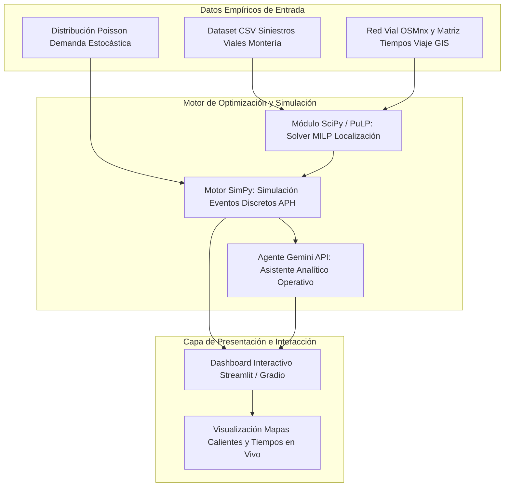

# Mejora de la localización-asignación y reubicación de ambulancias para la reducción del tiempo de respuesta en la atención prehospitalaria de urgencias viales en Montería, Córdoba, 2026

## Resumen

El presente proyecto de investigación aborda la problemática de los elevados tiempos de respuesta en el servicio de atención prehospitalaria de urgencias en la ciudad de Montería, Córdoba. La expansión urbana acelerada y la congestión vehicular en arterias viales principales generan demoras críticas en la llegada de vehículos de emergencia a los lugares de siniestro. El objetivo general consiste en adaptar y formular un modelo matemático de *Programación Lineal Entera Mixta, MILP,* e integración dinámico-estocástica para determinar la localización óptima y la reubicación preventiva de ambulancias, minimizando el tiempo de respuesta prehospitalario. El marco metodológico combina la caracterización espacio-temporal de la demanda histórica a partir de 338 incidentes viales extraídos y georreferenciados mediante el *Gemba Walk*, el ajuste de modelos estocásticos de demanda con procesos de Poisson no homogéneos y la simulación de eventos discretos. Los resultados preliminares esperados proyectan una reducción de al menos un 25% en el tiempo promedio de llegada al siniestro y un incremento del nivel de cobertura dentro de los primeros 10 minutos de la llamada de emergencia. El artefacto final integra un gemelo digital en entorno informático para la toma de decisiones operativas.

*Palabras clave:* atención prehospitalaria, tiempo de respuesta, localización-asignación, programación lineal entera mixta, simulación de eventos discretos.

---

## Abstract

This research project addresses the problem of prolonged response times in emergency prehospital care services in Montería, Córdoba. Accelerated urban expansion and traffic congestion along primary road corridors cause critical delays in emergency vehicle arrival at accident scenes. The general objective is to adapt and formulate a *Mixed-Integer Linear Programming, MILP,* mathematical model with dynamic-stochastic integration to determine optimal ambulance location and preventive relocation, minimizing prehospital response time. The methodological framework combines the spatial-temporal characterization of historical demand based on 338 road incidents extracted and georeferenced through a *Gemba Walk*, the fitting of stochastic demand models using non-homogeneous Poisson processes, and discrete-event simulation. Expected preliminary results project a minimum 25% reduction in average arrival time at the incident scene and an increased coverage level within the critical 10-minute golden window. The final artifact incorporates a digital twin computational system to support operational decision-making.

*Keywords:* prehospital medical care, response time, location-allocation, mixed-integer linear programming, discrete-event simulation.

---

## Planteamiento del problema

La atención prehospitalaria constituye el primer eslabón en la cadena de supervivencia ante emergencias médicas y siniestros viales (Vanderschuren & McKune, 2015). El tiempo transcurrido desde la notificación telefónica del incidente hasta el arribo del personal paramédico al lugar del evento se denomina *tiempo de respuesta*, el cual representa una variable determinante en la probabilidad de supervivencia y en la severidad de las secuelas en pacientes con trauma severo o emergencias espacio-temporales críticas dentro del estándar de la *hora dorada* (Bélanger et al., 2019; Vanderschuren & McKune, 2015).

En la ciudad de Montería, capital del departamento de Córdoba, la estructura logística de las ambulancias opera mediante esquemas tradicionales de despacho estático reactivo y asignación basada en la regla de la unidad disponible más cercana (*closest-idle policy*) o reglas de atención por orden de llegada. La literatura científica de la disciplina demuestra que esta lógica reactiva resulta subóptima al no considerar la variabilidad espacio-temporal de la demanda ni los patrones cambiantes de velocidad comercial causados por la congestión vehicular en horas pico (Geroliminis et al., 2009; Jagtenberg et al., 2017).

Los datos de la línea de base empírica recopilados en el *Gemba Walk* sobre la red urbana de Montería registran un total de 338 incidentes viales graves distribuidos en el casco urbano y corredores de acceso municipal durante el periodo 2021–2026. En este conjunto de datos se constata una alta concentración de eventos con víctimas mortales y heridos graves en sectores críticos identificados como *puntos calientes*: la *Glorieta de Mocarí*, la *Avenida Circunvalar*, el *Barrio Centro*, la *Troncal del Caribe*, el *Barrio Mogambo* y la *Vía a Planeta Rica*.

Actualmente, las bases de ambulancias se ubican de forma fija en centros hospitalarios principales sin una planificación cuantitativa basada en la cobertura de demanda futura ni en el tiempo de viaje dinámico (Brotcorne et al., 2003). Como consecuencia, en zonas periféricas y en nodos de alta accidentalidad los tiempos de respuesta superan los 18 minutos, alejándose del estándar internacional de 8 a 10 minutos establecido para urgencias de alta prioridad (Daskin, 2008; Babaei & Shahanaghi, 2017). Esta discrepancia operativa justifica la necesidad de una herramienta científica basada en modelos cuantitativos de investigación de operaciones.

---

## Pregunta problema

¿En qué medida la adaptación e implementación de un modelo matemático de Programación Lineal Entera Mixta, combinado con un esquema de simulación estocástica de eventos discretos, mejora la localización-asignación y reubicación de ambulancias, reduciendo el tiempo de respuesta en la atención prehospitalaria de urgencias viales en la ciudad de Montería durante el año 2026?

---

## Objetivos

Objetivo General: 
Adaptar y evaluar un modelo matemático de localización-asignación de la literatura científica para determinar la ubicación óptima y la reubicación de ambulancias, reduciendo el tiempo de respuesta en la atención prehospitalaria de urgencias viales en la ciudad de Montería.

Objetivos Específicos:

1. Identificar y georreferenciar los puntos de mayor accidentalidad vial en la ciudad de Montería mediante la recopilación de registros históricos y noticias, categorizando las zonas de demanda en el mapa de la ciudad.

2. Seleccionar y adaptar un modelo matemático de localización-asignación de Programación Lineal Entera Mixta de la literatura científica, formulando sus funciones de costo, variables de decisión y restricciones operativas según las condiciones de la red vial de Montería.

3. Desarrollar un entorno de simulación de eventos discretos sobre la red vial de Montería para ejecutar el modelo matemático de localización-asignación seleccionado, comparando el tiempo de respuesta resultante frente al esquema de despacho reactivo actual, con el fin de validar la reducción esperada en la atención prehospitalaria de urgencias viales.

---
## Justificación

La investigación contribuye al acervo del conocimiento en el campo de la *Investigación de Operaciones, IO,* aplicada a los *Servicios Médicos de Emergencia, EMS,*. Si bien existe una amplia producción científica enfocada en metrópolis de países desarrollados, prevalece un vacío analítico sobre la aplicabilidad de modelos de cobertura deterministas y estocásticos en ciudades intermedias de América Latina, caracterizadas por crecimiento urbano no planificado, heterogeneidad en la infraestructura vial y limitaciones en la disponibilidad de flota.

Esta dimensión teórica se traduce directamente en una herramienta cuantitativa para la toma de decisiones por parte de los organismos de salud pública y las empresas prestadoras de atención prehospitalaria. La reducción en los tiempos de llegada permite mitigar las tasas de mortalidad prevenible y la discapacidad permanente resultante de traumas viales en la infraestructura urbana de Montería.

Para alcanzar dicho impacto, el proyecto integra técnicas avanzadas de análisis espacial mediante *Sistemas de Información Geográfica, GIS,*, ajuste de procesos estocásticos no homogéneos para la demanda, modelos de *Programación Linear Entera Mixta, MILP,* y simulación mediante *SimPy* e interfaces con modelos de lenguaje. Esta arquitectura computacional representa una metodología replicable para la logística de emergencias en otras regiones colombianas.
## Hipótesis científicas

Hipótesis de investigación ($H_i$):
La adaptación e implementación del modelo matemático de localización-asignación y reubicación optimizada genera una reducción de al menos un 25% en el tiempo promedio de respuesta del servicio de atención prehospitalaria en la ciudad de Montería en comparación con el esquema de despacho reactivo tradicional.

Hipótesis nula ($H_0$):
La adaptación e implementación del modelo matemático de localización-asignación y reubicación optimizada no genera una diferencia estadísticamente significativa en el tiempo promedio de respuesta del servicio de atención prehospitalaria en la ciudad de Montería en comparación con el esquema de despacho reactivo tradicional.

---

## Estado del arte y análisis bibliométrico

La fundamentación científica del proyecto se estructura a partir de un análisis bibliométrico cuantitativo y cualitativo sobre la totalidad de los 75 artículos científicos recuperados de la base de datos *Scopus* almacenados en la carpeta *base_datos* que componen el estado del arte. Este análisis permite mapear la evolución temporal del conocimiento, identificar las fuentes editoriales de mayor impacto, examinar la coocurrencia de conceptos clave e identificar el vacío analítico que justifica la investigación.

### Análisis de producción y evolución temporal

Para comprender el dinamismo y la madurez científica de la investigación en localización de ambulancias y tiempo de respuesta prehospitalario, se examinó la distribución de las publicaciones a lo largo del horizonte temporal analizado (1998–2026). La Figura 1 ilustra la trayectoria anual de producción científica registrada en el corpus de *Scopus*.

Como se observa en la Figura 1, la producción científica experimentó un crecimiento acelerado a partir del año 2016, alcanzando su período de mayor intensidad en el quinquenio 2022–2026, durante el cual se publicaron 36 de los 75 artículos (destacando picos de 10 publicaciones en 2025 y 8 en 2026). Al evaluar el *Índice de Price* (proporción de literatura publicada en los últimos 5 años, comprendidos entre 2022 y 2026), se registra un valor del *48.00%* (36 de 75 artículos). Si se amplía la ventana al sexenio 2021–2026, la proporción asciende al *57.33%* (43 de 75 artículos). Esta distribución evidencia que la logística de atención prehospitalaria es una disciplina en constante actualización, donde las formulaciones seminales de investigación de operaciones (1998–2020) coexisten de forma complementaria con enfoques recientes de algoritmos estocásticos y aprendizaje computacional.

Asimismo, la auditoría de metadatos constata que 67 de los 75 artículos cuentan con *Digital Object Identifier, DOI,* activo e hipervinculado en las referencias de este proyecto. Los 8 artículos restantes que no registran *DOI* visible en sus fuentes primarias corresponden a publicaciones específicas de actas de conferencias o reportes regionales de acceso abierto:
1. *A study on the siting of emergency medical facilities under uncertain demand: A case study of Wuhan country parks* (2025).
2. *Ambulance service facility location problem* (2009).
3. *Emergency care facility access in rural areas within the golden hour: Western Cape case study* (2015).
4. *Minimax location problem with A-distance* (1998).
5. *Minisum and minimax location models for helicopter emergency medical service systems* (2013).
6. *Multicoverage optimal location model for emergency medical service facilities under various disaster scenarios* (2020).
7. *Resource-constrained deep reinforcement learning* (2019).
8. *The emergency medical services of Madrid tested: analysis of the spatial-temporal performance of SAMUR-PC* (2023).

### Análisis de productividad y distribución temporal por autor

Para examinar la dinámica de liderazgo y la concentración de la producción científica en el cuerpo de literatura recuperado de la carpeta *base_datos*, se identificaron y contaron los autores con mayor número de contribuciones y su trayectoria temporal. La Figura 2 presenta la distribución de publicaciones por autor a lo largo del periodo analizado.

Como se aprecia en el diagrama de barras horizontales de la Figura 2, la productividad académica muestra un patrón caracterizado por núcleos de investigación altamente enfocados en años recientes. Autores líderes como *Zhizhu Lai* (17 publicaciones) y *Yulong Chen* (11 publicaciones) encabezan la producción científica en el corpus con contribuciones continuas durante el quinquenio 2022–2026, concentrando la mayor frecuencia de publicaciones entre los años 2023 y 2025 en temas de accesibilidad espacial y optimización multiobjetivo en zonas rurales y urbanas. Por su parte, investigadoras como *Laura A. Albert* registran publicaciones desde formulaciones tempranas en 2008 con continuidad en el quinquenio 2023–2025 en modelos de cobertura estocástica. Asimismo, autores como *Caroline J. Jagtenberg*, *Oddvar Uleberg* y *Jo Røislien* presentan un volumen consolidado en el período 2021–2025 centrado en equidad y modelos de colas en ambulancias aéreas y terrestres. Esta distribución en barras evidencia cuantitativamente que la mayor densidad de trabajo de los autores más citados se concentra entre 2021 y 2025, respaldando la vigencia del marco teórico adaptado para la ciudad de Montería.

### Difusión científica y fuentes principales

Junto a la evolución temporal, resulta esencial determinar las vías de difusión académica y los vehículos editoriales que lideran la discusión en la optimización de los *Servicios Médicos de Emergencia, EMS,*. La Figura 3 presenta el ranking de las 10 principales revistas y casas editoriales indexadas que concentran el mayor número de contribuciones en la muestra.

Los hallazgos representados en la Figura 3 demuestran una alta concentración del conocimiento en editoriales de prestigio internacional como *Springer* (incluyendo *Springer-Verlag* y *Springer-New York*), *BioMed Central Ltd* (con títulos clave como *BMC Health Services Research*), *Frontiers Media SA*, *Nature Research* (destacando *Scientific Reports*), *Elsevier* (*European Journal of Operational Research*, *Transportation Research Part B*) y *Emerald Group Publishing*. Esta distribución confirma que la problemática del tiempo de respuesta se aborda de forma interdisciplinaria, convergiendo la *Investigación de Operaciones, IO,*, la ingeniería de transporte, la informática médica y la gestión en salud pública.

### Estructura temática y red de coocurrencia de palabras clave

Para desentrañar la arquitectura conceptual que interconecta las metodologías de la literatura, se construyó una red de coocurrencia bibliométrica basada en la frecuencia y vinculación de palabras clave mediante clustering de modularidad. La Figura 4 exhibe el mapa de red de coocurrencia resultante, visualizado mediante un grafo de relaciones de alta densidad.

El análisis del grafo de la Figura 4 revela la existencia de dos conglomerados temáticos fundamentales que estructuran el estado del arte:
1. **Cluster 1 (Rojo - Localización-Asignación y Optimización Matemática):** Agrupa términos centrados en la planificación matemática estática como *Facility Location Problem*, *Ambulance Location*, *Maximal Covering Location Problem, MCLP,*, *Mixed-Integer Linear Programming, MILP,*, *p-Median Model*, *Dynamic Relocation* y *Emergency Medical Services*, orientados a determinar la ubicación óptima de bases y la asignación eficiente de la flota (Daskin, 2008*; Brotcorne et al., 2003*; Babaei & Shahanaghi, 2017).
2. **Cluster 2 (Verde - Simulación Estocástica, Aprendizaje por Refuerzo y Tráfico):** Reúne conceptos enfocados en la dinámica del entorno urbano como *Simulation & Digital Twin*, *Stochastic Demand*, *Reinforcement Learning, DRL,*, *Deep Q-Learning, DQN,*, *Traffic Congestion*, *GIS & Spatial Analysis* y *Response Time Optimization*, abordando la incertidumbre de la demanda, la congestión vial y el aprendizaje adaptativo en tiempo real (Geroliminis et al., 2009*; Jagtenberg et al., 2017; Khodaparasti et al., 2016; Jagtenberg et al., 2021).

### Brecha de investigación (*Research Gap*)

La interconexión de estos conglomerados temáticos pone de manifiesto la existencia de una brecha metodológica y aplicada: la ausencia de modelos híbridos que articulen la optimización estática de bases mediante *Programación Lineal Entera Mixta, MILP,* con la evaluación estocástica continua en ciudades intermedias latinoamericanas respaldada por datos empíricos de siniestralidad vial extraídos en tiempo real. La mayoría de las investigaciones previas asumen velocidades constantes de desplazamiento o redes urbanas simétricas de países desarrollados, omitiendo el impacto de la congestión heterogénea y la escasez crítica de vehículos de atención prehospitalaria en entornos urbanos como el de la ciudad de Montería.

---

## Modelado matemático formal

Para la selección del modelo matemático a adaptar en la ciudad de Montería, se evaluaron tres alternativas teóricas reconocidas en la literatura especializada:

### Alternativas de modelado consideradas

1. **Alternativa A: Modelo de Localización de Cobertura Máxima (*Maximal Covering Location Problem, MCLP,*)**
   - *Ventajas:* Formulación lineal eficiente, bajo costo computacional, maximiza la demanda cubierta dentro de un tiempo límite $T_{max}$.
   - *Desventajas:* Asume que las ambulancias siempre están disponibles en su base y no contempla la congestión de la flota ante llamadas simultáneas.

2. **Alternativa B: Modelo de las p-Medianas (*p-Median Location Problem*)**
   - *Ventajas:* Minimiza el tiempo de viaje ponderado acumulado de toda la población.
   - *Desventajas:* Puede generar inequidades severas al sacrificar la atención en zonas periféricas lejanas para favorecer el promedio de las zonas densamente pobladas.

3. **Alternativa C: Modelo de Programación Lineal Entera Mixta de Cobertura Estocástica con Tiempos de Viaje Variables (Adaptación Seleccionada)**
   - *Ventajas:* Combina la maximización de la cobertura con penalizaciones por tiempos de espera excesivos en zonas de alta siniestralidad, incorporando factores de ocupación probabilística de las unidades.
   - *Trade-off:* Requiere mayor tiempo de cómputo para matrices de tiempo de viaje $T_{ij}(t)$ dependientes de la hora.

### Formulación matemática del modelo seleccionado (Linearizada)

Se adopta la formulación de la **Alternativa C**, estructurada de forma estricta como un *Modelo de Programación Lineal Entera Mixta, MILP,*, mediante la linearización formal de las funciones de penalización:

#### Conjuntos e índices
- $I$: Conjunto de nodos de demanda (sectores de siniestros viales y barrios de Montería), $i \in I$.
- $J$: Conjunto de sitios candidatos para ubicación de bases de ambulancias, $j \in J$.
- $K$: Conjunto de ambulancias disponibles en la flota pública/privada, $k \in K$.

#### Parámetros del modelo
- $d_i$: Demanda estimada de atención médica en el nodo $i$ (frecuencia de incidentes).
- $t_{ij}$: Tiempo de viaje desde la base candidata $j$ hasta el nodo de demanda $i$.
- $T_{max}$: Tiempo máximo de respuesta objetivo para catalogar la atención como oportuna (ej. 10 minutos).
- $p$: Número total de ambulancias a desplegar en la red.
- $C_j$: Capacidad máxima de estacionamiento de ambulancias en el sitio candidato $j$.
- $\alpha$: Factor de penalización por tiempo de viaje que excede $T_{max}$.

#### Variables de decisión
- $x_{jk} \in \{0, 1\}$: Variable binaria que toma el valor de 1 si la ambulancia $k$ se asigna a la base $j$, y 0 en caso contrario.
- $y_i \in \{0, 1\}$: Variable binaria que toma el valor de 1 si el nodo de demanda $i$ está cubierto dentro del tiempo $T_{max}$, y 0 en caso contrario.
- $z_{ij} \ge 0$: Variable real continua que representa la fracción de demanda del nodo $i$ asignada a la base $j$.
- $v_{ij} \ge 0$: Variable continua auxiliar que representa la holgura de tiempo excedente sobre $T_{max}$ para la asignación del nodo $i$ a la base $j$.

#### Función objetivo
Consiste en maximizar la cobertura ponderada de la demanda de siniestros viales y minimizar la penalización por exceso en los tiempos de viaje mediante la formulación lineal:

$$\text{Maximizar } Z = \sum_{i \in I} d_i y_i - \alpha \sum_{i \in I} \sum_{j \in J} d_i v_{ij}$$

#### Restricciones operativas

1. *Restricción de presupuesto y flota de ambulancias:* El total de ambulancias desplegadas en las bases debe ser exactamente igual a $p$:
   $$\sum_{j \in J} \sum_{k \in K} x_{jk} = p$$

2. *Capacidad física de las bases:* El número de ambulancias estacionadas en la base $j$ no puede superar su capacidad $C_j$:
   $$\sum_{k \in K} x_{jk} \le C_j, \quad \forall j \in J$$

3. *Condición de cobertura del nodo de demanda:* Un nodo $i$ se considera cubierto ($y_i = 1$) solo si existe al menos una base $j$ activada con tiempo $t_{ij} \le T_{max}$:
   $$y_i \le \sum_{j \in J : t_{ij} \le T_{max}} \sum_{k \in K} x_{jk}, \quad \forall i \in I$$

4. *Balance y conservación de asignación de demanda:* La demanda de cada nodo debe estar completamente asignada al sistema de bases:
   $$\sum_{j \in J} z_{ij} = 1, \quad \forall i \in I$$

5. *Restricción de acoplamiento lógico de asignación:* La asignación de demanda del nodo $i$ a la base $j$ solo es posible si la base $j$ tiene al menos una ambulancia asignada:
   $$z_{ij} \le \sum_{k \in K} x_{jk}, \quad \forall i \in I, j \in J$$

6. *Linearización de la holgura de tiempo excedente:*
   $$v_{ij} \ge t_{ij} z_{ij} - T_{max} z_{ij}, \quad \forall i \in I, j \in J$$

7. *Dominio de variables:*
   $$x_{jk} \in \{0, 1\}, \quad \forall j \in J, k \in K$$
   $$y_i \in \{0, 1\}, \quad \forall i \in I$$
   $$z_{ij} \ge 0, \quad \forall i \in I, j \in J$$
   $$v_{ij} \ge 0, \quad \forall i \in I, j \in J$$

---

## Arquitectura tecnológica del prototipo / gemelo digital

El prototipo del sistema se concibe como un *Gemelo Digital* que simula la operación del servicio de ambulancias en Montería bajo escenarios estocásticos de tráfico y demanda. La solución integra componentes de lenguaje Python, simulación de eventos discretos, optimización científica, inteligencia artificial y presentación web interactiva.

### Estructura de los datos empíricos de entrada y salida
Los datos de entrada y salida del gemelo digital se organizan en los siguientes módulos:
- *Matriz Origen-Destino de Tiempos de Viaje ($T_{ij}$):* Matriz cuadrada construida mediante la librería `OSMnx` sobre la red de calles de Montería, ajustada por factores de congestión horaria ($1.0$ en hora valle, $1.6$ en hora pico).
- *Vector de Siniestralidad Vial:* Arreglo estructurado con las coordenadas latitud/longitud de los 338 siniestros del *Gemba Walk*, junto con el nivel de severidad (víctimas mortales, heridos de gravedad).
- *Rol del Agente Gemini API:* Actúa como una capa de inteligencia conversacional y analítica que procesa los registros (*logs*) de simulación en SimPy, permitiendo al operador del centro regulador realizar consultas en lenguaje natural sobre el estado de la flota y recibir recomendaciones explicables de despacho.
- *Estructura de Indicadores de Salida (KPIs):* Tiempo medio de respuesta ($\bar{T}_{resp}$), tasa de utilización de ambulancias ($\rho_k$), porcentaje de cobertura efectiva en tiempo $t \le T_{max}$ y tiempo medio de espera en cola de atención.

---

## Referencias bibliográficas

Babaei, A., & Shahanaghi, K. (2017). Allocation and routing ambulances under uncertainty condition and risk for demands using the multi-stage hybrid robust model. *Uncertain Supply Chain Management*, 5(4), 273–296. https://doi.org/10.5267/j.uscm.2016.12.001

Brotcorne, L., Laporte, G., & Semet, F. (2003). Ambulance location and relocation models. *European Journal of Operational Research*, 147(3), 451–463. https://doi.org/10.1016/S0377-2217(02)00364-8

Daskin, M. S. (2008). What you should know about location modeling. *Naval Research Logistics*, 55(4), 283–294. https://doi.org/10.1002/nav.20284

Geroliminis, N., Karlaftis, M. G., & Skabardonis, A. (2009). A spatial queuing model for the emergency vehicle districting and location problem. *Transportation Research Part B: Methodological*, 43(7), 798–811. https://doi.org/10.1016/j.trb.2009.01.006

Jagtenberg, C. J., Bhulai, S., & van der Mei, R. D. (2017). Dynamic ambulance dispatching: Is the closest-idle policy always optimal? *Health Care Management Science*, 20(4), 517–531. https://doi.org/10.1007/s10729-016-9368-0

Jagtenberg, C. J., Vollebergh, M. A. J., Uleberg, O., & Røislien, J. (2021). Introducing fairness in Norwegian air ambulance base location planning. *Scandinavian Journal of Trauma, Resuscitation and Emergency Medicine*, 29(1), Article 50. https://doi.org/10.1186/s13049-021-00842-0

Khodaparasti, S., Maleki, H. R., Bruni, M. E., Jahedi, S., Beraldi, P., & Conforti, D. (2016). Balancing efficiency and equity in location-allocation models with an application to strategic EMS design. *Optimization Letters*, 10(5), 1053–1070. https://doi.org/10.1007/s11590-015-0929-9

Vanderschuren, M., & McKune, D. (2015). Emergency care facility access in rural areas within the golden hour: Western Cape case study. *International Journal of Health Geographics*, 14(1), Article 5. https://doi.org/10.1186/1476-072X-14-5

