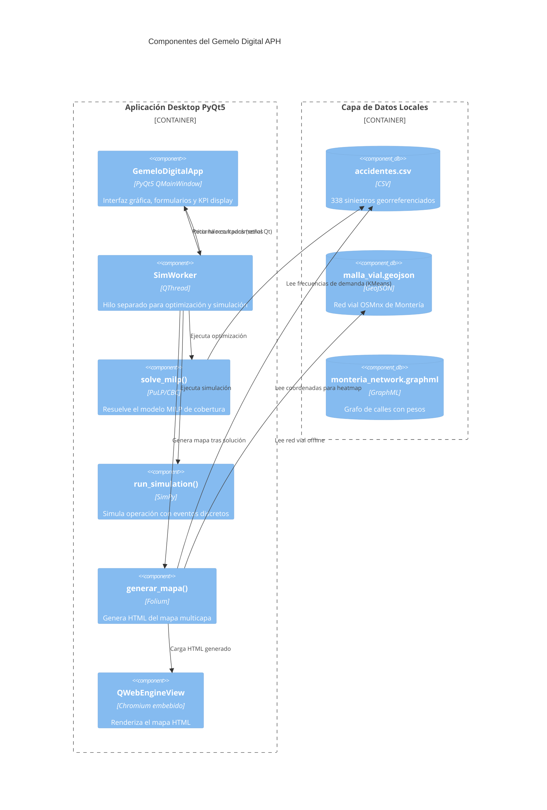
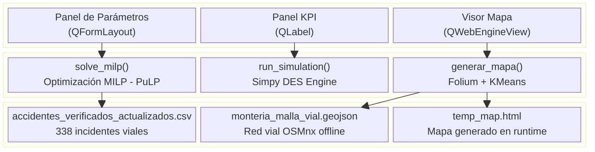
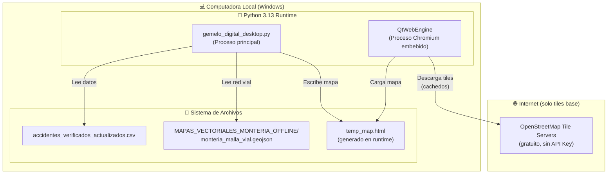

# 02 — Arquitectura del Sistema (UML)

## Diagrama de Componentes — Visión General

```mermaid
C4Component
    title Componentes del Gemelo Digital APH

    Container_Boundary(app, "Aplicación Desktop PyQt5") {
        Component(ui, "GemeloDigitalApp", "PyQt5 QMainWindow", "Interfaz gráfica, formularios y KPI display")
        Component(worker, "SimWorker", "QThread", "Hilo separado para optimización y simulación")
        Component(milp, "solve_milp()", "PuLP/CBC", "Resuelve el modelo MILP de cobertura")
        Component(sim, "run_simulation()", "SimPy", "Simula operación con eventos discretos")
        Component(mapa, "generar_mapa()", "Folium", "Genera HTML del mapa multicapa")
        Component(viewer, "QWebEngineView", "Chromium embebido", "Renderiza el mapa HTML")
    }

    Container_Boundary(datos, "Capa de Datos Locales") {
        ComponentDb(csv, "accidentes.csv", "CSV", "338 siniestros georreferenciados")
        ComponentDb(geojson, "malla_vial.geojson", "GeoJSON", "Red vial OSMnx de Montería")
        ComponentDb(graphml, "monteria_network.graphml", "GraphML", "Grafo de calles con pesos")
    }

    Rel(ui, worker, "Inicia hilo con parámetros")
    Rel(worker, milp, "Ejecuta optimización")
    Rel(worker, sim, "Ejecuta simulación")
    Rel(worker, mapa, "Genera mapa tras solución")
    Rel(mapa, viewer, "Carga HTML generado")
    Rel(milp, csv, "Lee frecuencias de demanda (KMeans)")
    Rel(mapa, csv, "Lee coordenadas para heatmap")
    Rel(mapa, geojson, "Lee red vial offline")
    Rel(worker, ui, "Retorna resultados (señal Qt)")
```

---

## Diagrama de Capas — Arquitectura en 3 Niveles

```mermaid
block-beta
    columns 3
    
    block:UI["🖥️ Capa de Presentación"]:3
        A["Panel de Parámetros\n(QFormLayout)"]
        B["Panel KPI\n(QLabel)"]
        C["Visor Mapa\n(QWebEngineView)"]
    end
    
    block:LOGIC["⚙️ Capa de Lógica"]:3
        D["solve_milp()\nOptimización MILP - PuLP"]
        E["run_simulation()\nSimpy DES Engine"]
        F["generar_mapa()\nFolium + KMeans"]
    end
    
    block:DATA["💾 Capa de Datos"]:3
        G["accidentes_verificados_actualizados.csv\n338 incidentes viales"]
        H["monteria_malla_vial.geojson\nRed vial OSMnx offline"]
        I["temp_map.html\nMapa generado en runtime"]
    end
    
    A --> D
    B --> E
    C --> F
    D --> G
    F --> H
    F --> I
```

---

## Diagrama de Despliegue (UML Deployment)

```mermaid
graph TD
    subgraph PC["💻 Computadora Local (Windows)"]
        subgraph Python["🐍 Python 3.13 Runtime"]
            APP["gemelo_digital_desktop.py\n(Proceso principal)"]
            QT["QtWebEngine\n(Proceso Chromium embebido)"]
        end
        
        subgraph FS["📁 Sistema de Archivos"]
            CSV["accidentes_verificados_actualizados.csv"]
            GJ["MAPAS_VECTORIALES_MONTERIA_OFFLINE/\nmonteria_malla_vial.geojson"]
            HTML["temp_map.html\n(generado en runtime)"]
        end
    end

    subgraph Internet["🌐 Internet (solo tiles base)"]
        OSM["OpenStreetMap Tile Servers\n(gratuito, sin API Key)"]
    end

    APP -->|"Lee datos"| CSV
    APP -->|"Lee red vial"| GJ
    APP -->|"Escribe mapa"| HTML
    QT -->|"Carga mapa"| HTML
    QT -->|"Descarga tiles\n(cachedos)"| OSM
```
