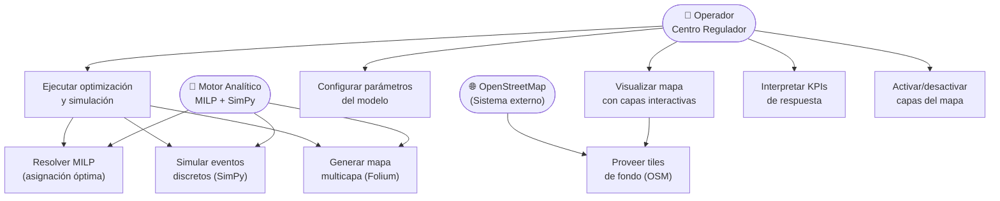

# 03 — Diagrama de Casos de Uso (UML)

## Actores del Sistema

| Actor | Rol | Interacción |
|-------|-----|-------------|
| **Operador del Centro Regulador** | Usuario primario | Configura parámetros, ejecuta simulación, interpreta KPIs |
| **Paramédico / Conductor** | Usuario secundario | Recibe recomendación de despacho (futuro: app móvil) |
| **Motor Analítico (MILP+SimPy)** | Sistema interno | Resuelve el modelo, genera resultados |
| **Fuente de Datos OSM** | Sistema externo | Provee tiles del mapa de fondo (OpenStreetMap) |

---

## Diagrama de Casos de Uso

---

## Descripción de Casos de Uso Críticos

### CU-01: Ejecutar Optimización y Simulación

| Campo | Detalle |
|-------|---------|
| **Nombre** | Ejecutar Optimización & Simulación |
| **Actor principal** | Operador del Centro Regulador |
| **Precondición** | Parámetros ingresados y válidos (p ≥ 1, T_max > 0, bases ≥ 1) |
| **Flujo principal** | 1. Operador define parámetros → 2. Sistema calcula centros de cluster (KMeans sobre CSV) → 3. Construye matriz $t_{ij}$ → 4. Resuelve MILP → 5. Corre SimPy 720h → 6. Genera mapa → 7. Muestra KPIs |
| **Flujo alternativo** | Si el MILP no encuentra solución óptima → muestra alerta con estado del solver |
| **Postcondición** | Mapa actualizado con ambulancias asignadas y KPIs visibles en panel |

### CU-02: Visualizar Mapa Multicapa

| Campo | Detalle |
|-------|---------|
| **Nombre** | Visualizar Mapa con Capas Interactivas |
| **Actor principal** | Operador del Centro Regulador |
| **Precondición** | Al menos una simulación ejecutada o mapa inicial generado |
| **Flujo principal** | 1. Mapa carga con 4 capas activas → 2. Operador usa control de capas para ocultar/mostrar → 3. Hace clic en un marcador para ver popup |
| **Postcondición** | Operador visualiza distribución geográfica de la flota |
