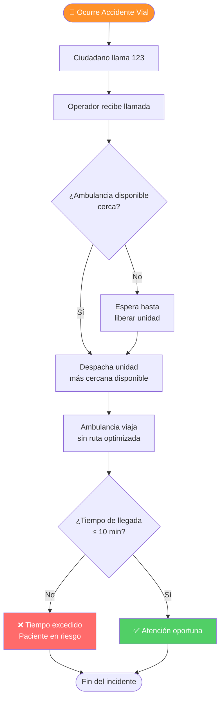
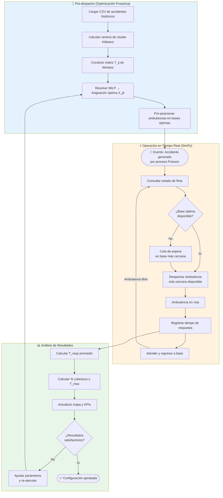
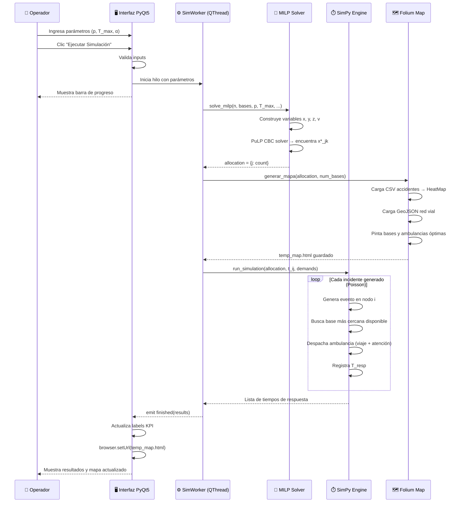

# 04 — Flujo de Procesos BPMN

## Comparación AS-IS vs TO-BE

### Estado Actual (AS-IS): Despacho Reactivo Estático

---

### Estado Propuesto (TO-BE): Despacho Inteligente con Gemelo Digital

---

## Diagrama de Secuencia: Ciclo de Vida de un Incidente

