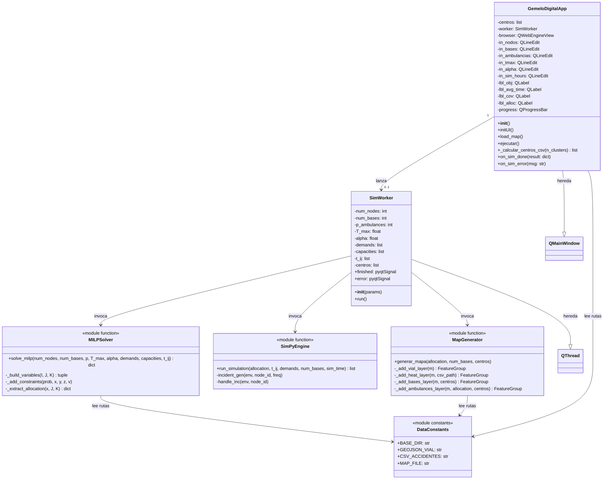

# 05 — Diagrama de Clases (UML)

## Estructura Orientada a Objetos del Sistema

---

## Relaciones de Responsabilidad

| Clase / Módulo | Responsabilidad | Patrón |
|----------------|-----------------|--------|
| `GemeloDigitalApp` | Orquestación de UI y comunicación con el worker | MVC (View + Controller) |
| `SimWorker` | Ejecutar cálculos pesados fuera del hilo principal | Worker Thread Pattern |
| `solve_milp()` | Resolver el modelo MILP con PuLP | Strategy Pattern |
| `run_simulation()` | Ejecutar la simulación DES con SimPy | Strategy Pattern |
| `generar_mapa()` | Construir y serializar el mapa Folium | Builder Pattern |
| `DataConstants` | Centralizar las rutas de archivos del proyecto | Constants Module |
