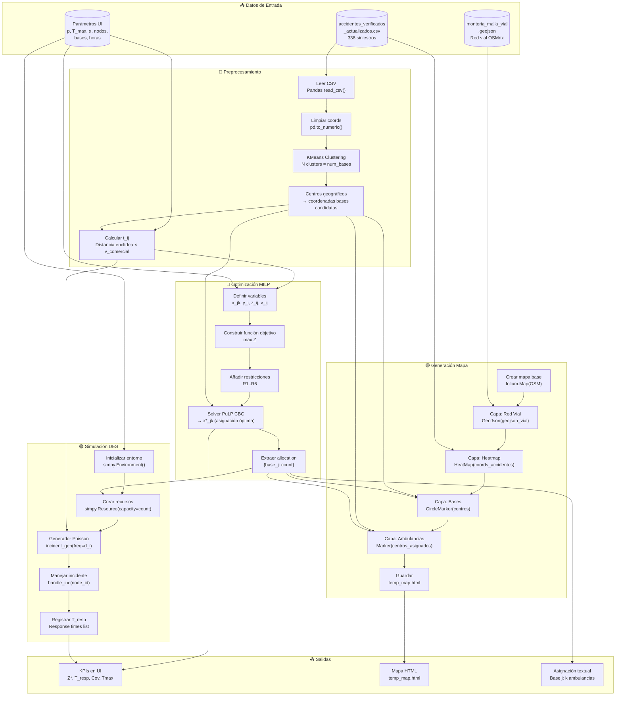

# 06 — Diagrama de Flujo de Datos

## Flujo Completo de Datos del Sistema

```mermaid
flowchart TD
    subgraph INPUT["📥 Datos de Entrada"]
        D1[("accidentes_verificados\n_actualizados.csv\n338 siniestros")]
        D2[("monteria_malla_vial\n.geojson\nRed vial OSMnx")]
        D3[("Parámetros UI\np, T_max, α, nodos,\nbases, horas")]
    end

    subgraph PROC1["🔵 Preprocesamiento"]
        P1["Leer CSV\nPandas read_csv()"]
        P2["Limpiar coords\npd.to_numeric()"]
        P3["KMeans Clustering\nN clusters = num_bases"]
        P4["Centros geográficos\n→ coordenadas bases candidatas"]
        P5["Calcular t_ij\nDistancia euclídea × v_comercial"]
    end

    subgraph PROC2["🔴 Optimización MILP"]
        M1["Definir variables\nx_jk, y_i, z_ij, v_ij"]
        M2["Construir función objetivo\nmax Z"]
        M3["Añadir restricciones\nR1..R6"]
        M4["Solver PuLP CBC\n→ x*_jk (asignación óptima)"]
        M5["Extraer allocation\n{base_j: count}"]
    end

    subgraph PROC3["🟢 Simulación DES"]
        S1["Inicializar entorno\nsimpy.Environment()"]
        S2["Crear recursos\nsimpy.Resource(capacity=count)"]
        S3["Generador Poisson\nincident_gen(freq=d_i)"]
        S4["Manejar incidente\nhandle_inc(node_id)"]
        S5["Registrar T_resp\nResponse times list"]
    end

    subgraph PROC4["🟡 Generación Mapa"]
        G1["Crear mapa base\nfolium.Map(OSM)"]
        G2["Capa: Red Vial\nGeoJson(geojson_vial)"]
        G3["Capa: Heatmap\nHeatMap(coords_accidentes)"]
        G4["Capa: Bases\nCircleMarker(centros)"]
        G5["Capa: Ambulancias\nMarker(centros_asignados)"]
        G6["Guardar\ntemp_map.html"]
    end

    subgraph OUTPUT["📤 Salidas"]
        O1["KPIs en UI\nZ*, T_resp, Cov, Tmax"]
        O2["Mapa HTML\ntemp_map.html"]
        O3["Asignación textual\nBase j: k ambulancias"]
    end

    D1 --> P1 --> P2 --> P3 --> P4 --> P5
    D3 --> P5
    D3 --> M1
    P5 --> M1
    P4 --> M4
    M1 --> M2 --> M3 --> M4 --> M5

    M5 --> S2
    P5 --> S3
    D3 --> S1
    S1 --> S2 --> S3 --> S4 --> S5

    M5 --> G4
    M5 --> G5
    P4 --> G4
    P4 --> G5
    D1 --> G3
    D2 --> G2
    G1 --> G2 --> G3 --> G4 --> G5 --> G6

    S5 --> O1
    M4 --> O1
    G6 --> O2
    M5 --> O3
```
