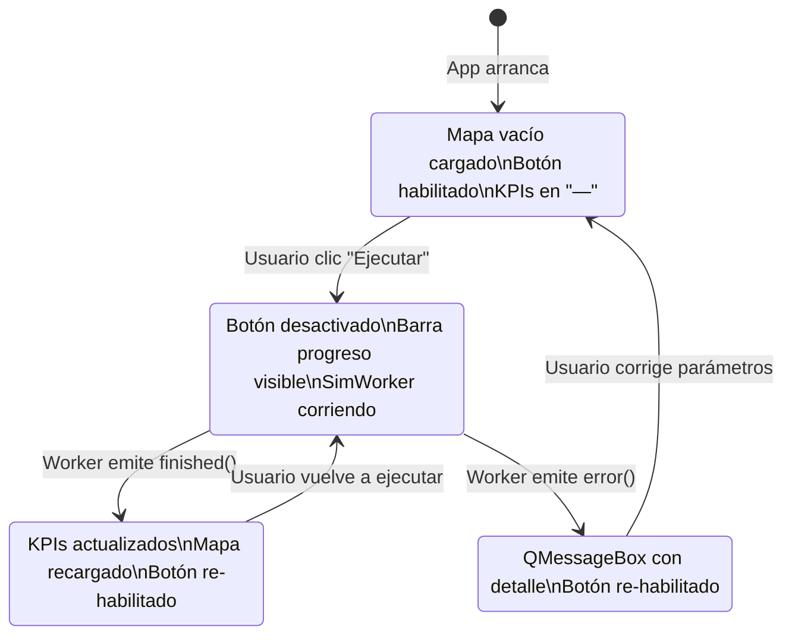

# 07 — Especificación de la Interfaz de Usuario

## Layout General de la Aplicación

```
┌─────────────────────────────────────────────────────────────────────────────┐
│  🚑 Gemelo Digital APH — Montería, Córdoba              [— □ ✕]             │
├─────────────────┬───────────────────────────────────────────────────────────┤
│  🚑 Gemelo      │                                                            │
│  Digital APH    │                                                            │
│                 │          🗺️  MAPA INTERACTIVO FOLIUM + OSM                 │
│ ┌─ Parámetros ┐ │                                                            │
│ │Nodos  [4  ] │ │    ┌──────────────────────────────────────────────────┐   │
│ │Bases  [4  ] │ │    │ [🗺️ Red Vial] [🔥 Heatmap] [🏥 Bases] [🚑 Ambul] │   │
│ │Ambul  [6  ] │ │    │                                                  │   │
│ │T_max  [10.0]│ │    │  ●  ●  ●  (marcadores de bases candidatas)      │   │
│ │Alpha  [0.5 ]│ │    │  🚑  🚑  (marcadores de ambulancias óptimas)    │   │
│ │Horas  [720 ]│ │    │                                                  │   │
│ └─────────────┘ │    │  [Mapa de calor con zonas en rojo/naranja]      │   │
│                 │    │                                                  │   │
│ [⚡ EJECUTAR   ]│    └──────────────────────────────────────────────────┘   │
│                 │                                                            │
│ ████████░░░░░   │     Control de capas:  ☑ Red Vial  ☑ Heatmap              │
│ (progreso)      │                        ☑ Bases     ☑ Ambulancias          │
│                 │                                                            │
│ ┌─ KPIs ──────┐ │                                                            │
│ │Z*: 124.50   │ │                                                            │
│ │T̄: 8.32 min  │ │                                                            │
│ │Tmax: 18.1m  │ │                                                            │
│ │Cov: 74.3%   │ │                                                            │
│ │Inc: 1,204   │ │                                                            │
│ │─────────────│ │                                                            │
│ │Asignación:  │ │                                                            │
│ │ Base 0: 2   │ │                                                            │
│ │ Base 1: 3   │ │                                                            │
│ │ Base 3: 1   │ │                                                            │
│ └─────────────┘ │                                                            │
└─────────────────┴───────────────────────────────────────────────────────────┘
```

---

## Descripción de Componentes UI

### Panel Izquierdo — Configuración y Resultados (Ancho fijo: 370px)

| Componente | Widget PyQt5 | Descripción |
|-----------|--------------|-------------|
| Título del sistema | `QLabel` | Nombre del gemelo digital y contexto |
| Formulario de parámetros | `QFormLayout` en `QGroupBox` | 6 campos de texto: nodos, bases, flota, T_max, alpha, horas |
| Botón ejecutar | `QPushButton` | Dispara el `SimWorker`; se desactiva durante cálculo |
| Barra de progreso | `QProgressBar` | Modo indeterminado (spin) durante cálculo; oculta en reposo |
| Panel KPI | `QGroupBox` con `QLabel`s | Muestra Z*, T_resp promedio, T_max, cobertura, incidentes |
| Texto de asignación | `QLabel` con word wrap | Lista cada base y cantidad de ambulancias asignadas |

### Panel Derecho — Mapa (Expansible)

| Componente | Widget PyQt5 | Descripción |
|-----------|--------------|-------------|
| Visor Web | `QWebEngineView` | Renderiza el HTML de Folium con Leaflet.js embebido |
| Control de capas | Leaflet LayerControl (HTML) | Permite activar/ocultar 4 capas desde el mapa mismo |

---

## Estados de la Interfaz



---

## Guía de Uso Paso a Paso

1. **Ejecutar la aplicación:**
   ```bash
   python gemelo_digital_desktop.py
   ```

2. **Configurar parámetros** en el panel izquierdo:
   - **Nodos de demanda (|I|):** Número de zonas de accidentalidad a modelar. Recomendado: igual al número de bases o mayor.
   - **Bases candidatas (|J|):** Puntos donde el MILP puede colocar ambulancias. El sistema calcula sus coordenadas automáticamente desde los clusters de accidentes.
   - **Flota total (p):** Total de ambulancias a asignar. Debe ser ≤ suma de capacidades de las bases.
   - **T_max:** Umbral crítico en minutos. La literatura recomienda 10 min para urgencias de prioridad alta.
   - **Penalización (α):** Peso del costo por retrasos. A mayor α, el modelo priorizará más evitar exceder T_max.
   - **Horizonte de simulación:** Duración en horas de la simulación SimPy (720h = 30 días).

3. **Presionar "⚡ Ejecutar Simulación & Optimización".**

4. **Esperar** a que la barra de progreso desaparezca (entre 5 y 30 segundos según tamaño del problema).

5. **Interpretar resultados:**
   - **Z*:** A mayor valor, mejor configuración de cobertura vs. penalización.
   - **Cobertura ≥ 75%** es el objetivo mínimo del proyecto.
   - **T_resp promedio < 10 min** indica éxito operativo.

6. **Explorar el mapa:** Usa los controles de capas (esquina superior derecha del mapa) para activar/desactivar cada capa.
