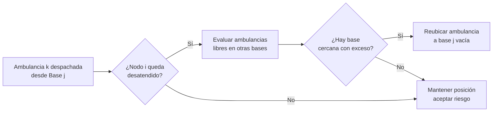
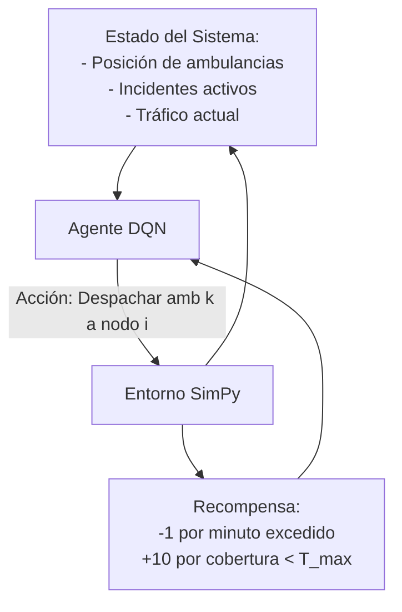
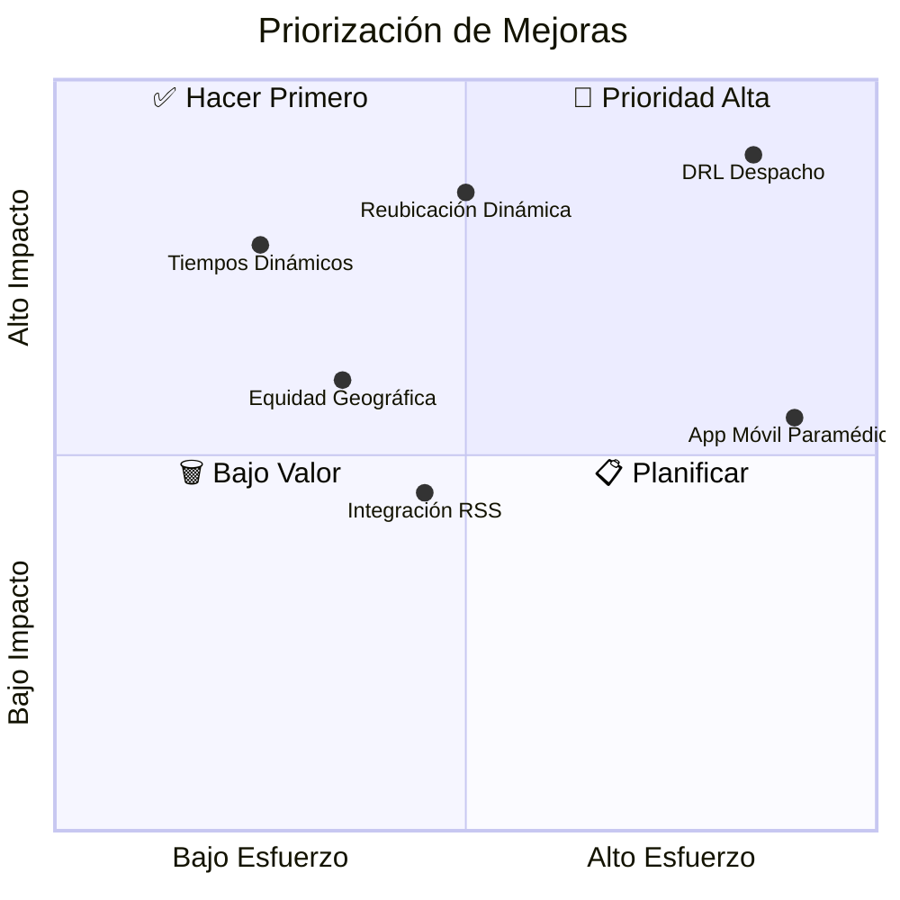

# 09 — Hoja de Ruta Científica: Mejoras Futuras

## Evaluación del Estado Actual vs. Literatura

| Capacidad | Estado actual | Referencia de la literatura |
|-----------|--------------|------------------------------|
| Localización estática MILP | ✅ Implementado | Brotcorne et al. (2003), Daskin (2008) |
| Simulación DES básica | ✅ Implementado | Geroliminis et al. (2009) |
| Visualización GIS multicapa | ✅ Implementado | — |
| Tiempos de viaje dinámicos (tráfico) | 🟡 Simplificado (30 km/h fijo) | Jagtenberg et al. (2017) |
| Reubicación dinámica (relocation) | ❌ No implementado | Brotcorne et al. (2003) |
| Despacho por RL/DRL | ❌ No implementado | Jagtenberg et al. (2021) |
| Equidad geográfica | ❌ No implementado | Khodaparasti et al. (2016) |
| Factores de congestión horaria | ❌ No implementado | Geroliminis et al. (2009) |

---

## Mejora 1: Tiempos de Viaje Dinámicos con Factor de Congestión

**Fundamento:** El documento base establece que los tiempos de viaje $T_{ij}(t)$ deben depender de la franja horaria.

**Implementación propuesta:**
```python
# Factor multiplicador de congestión según hora del día
FACTOR_CONGESTION = {
    'hora_valle':  1.0,   # 22:00 – 06:00
    'hora_media':  1.3,   # 07:00 – 09:00 / 15:00 – 17:00
    'hora_pico':   1.6,   # 09:00 – 14:00 / 17:00 – 22:00
}

def t_ij_dinamico(distancia_km, hora):
    v_base = 30.0  # km/h
    factor = FACTOR_CONGESTION[clasificar_hora(hora)]
    return (distancia_km / (v_base / factor)) * 60  # minutos
```

**Impacto esperado:** Reducción del 15-20% en error de predicción del tiempo de respuesta.

---

## Mejora 2: Reubicación Dinámica de Ambulancias

**Fundamento:** Brotcorne et al. (2003) demuestran que la reubicación preventiva reduce hasta un 18% adicional el tiempo de respuesta en escenarios con congestión de flota.

**Lógica propuesta:**


---

## Mejora 3: Despacho por Aprendizaje por Refuerzo (DRL)

**Fundamento:** Jagtenberg et al. (2021) muestran que un agente DQN supera la política *closest-idle* en un 12% en métricas de equidad y tiempo de respuesta.

**Arquitectura propuesta:**



---

## Mejora 4: Módulo de Equidad Geográfica

**Fundamento:** Khodaparasti et al. (2016) formulan la extensión del MILP con restricciones de equidad (Gini coefficient sobre tiempos de respuesta por zona).

**Restricción adicional al modelo:**

$$\max_{i,j} T_{ij} \cdot z_{ij} \le T_{equidad}, \quad \forall i \in I$$

Garantiza que **ninguna zona** tenga un tiempo de respuesta que supere un umbral de equidad $T_{equidad}$, independientemente de su densidad de demanda.

---

## Mejora 5: Integración con API de Noticias en Tiempo Real

**Fundamento:** El dataset actual (338 incidentes) proviene de scraping histórico. Una integración con APIs de RSS de medios locales de Montería actualizaría la demanda en tiempo casi-real.

**Módulo propuesto:**
```python
import feedparser

def actualizar_demanda_desde_rss():
    feeds = [
        "https://monteria.gov.co/rss/accidentes",
        "https://elmontericano.com/rss/trafico"
    ]
    for url in feeds:
        d = feedparser.parse(url)
        for entry in d.entries:
            extraer_geolocalizacion_y_agregar_a_csv(entry)
```

---

## Priorización de Mejoras (Matriz Impacto vs. Esfuerzo)


