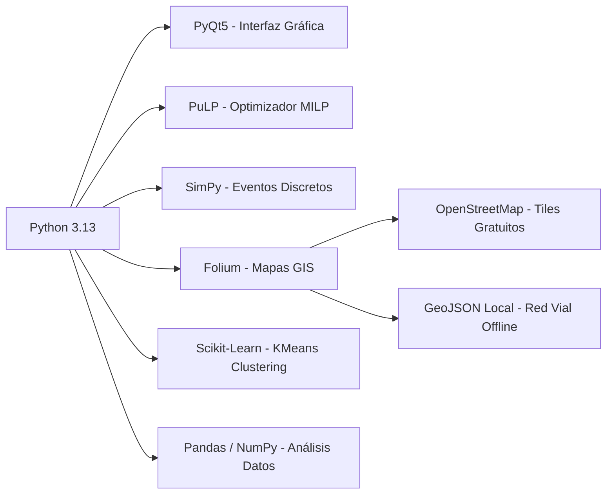

# Gemelo Digital APH — Documentación Científica del Sistema
### Proyecto Integrador II | Ingeniería Industrial | Montería, Córdoba, 2026

---

## Índice de Documentación

| Documento | Descripción |
|-----------|-------------|
| [01_modelo_matematico.md](./01_modelo_matematico.md) | Formulación MILP completa con notación matemática formal |
| [02_arquitectura_sistema.md](./02_arquitectura_sistema.md) | Diagramas de componentes, capas y despliegue (UML) |
| [03_casos_de_uso.md](./03_casos_de_uso.md) | Diagrama de Casos de Uso y actores del sistema |
| [04_flujo_procesos_bpmn.md](./04_flujo_procesos_bpmn.md) | Flujo de procesos operativos AS-IS vs TO-BE (BPMN) |
| [05_diagrama_clases.md](./05_diagrama_clases.md) | Estructura de clases del software (UML Clases) |
| [06_flujo_datos.md](./06_flujo_datos.md) | Diagrama de flujo de datos y secuencias |
| [07_interfaz_usuario.md](./07_interfaz_usuario.md) | Especificación de la interfaz gráfica |
| [08_manual_despliegue.md](./08_manual_despliegue.md) | Instrucciones de instalación, ejecución y compilación |
| [09_mejoras_futuras.md](./09_mejoras_futuras.md) | Hoja de ruta científica de mejoras propuestas |

---

## Resumen Ejecutivo del Sistema

El **Gemelo Digital APH** es una aplicación de escritorio nativa desarrollada en Python que integra tres pilares científicos para optimizar la operación del servicio de atención prehospitalaria de urgencias viales en la ciudad de Montería:

1. **Optimización Matemática (MILP):** Determina la ubicación óptima de ambulancias.  
2. **Simulación de Eventos Discretos (SimPy):** Evalúa el desempeño operativo en el tiempo.  
3. **Análisis Geoespacial (Folium + OSMnx):** Visualiza resultados sobre la red vial real.

### Tecnologías Clave

