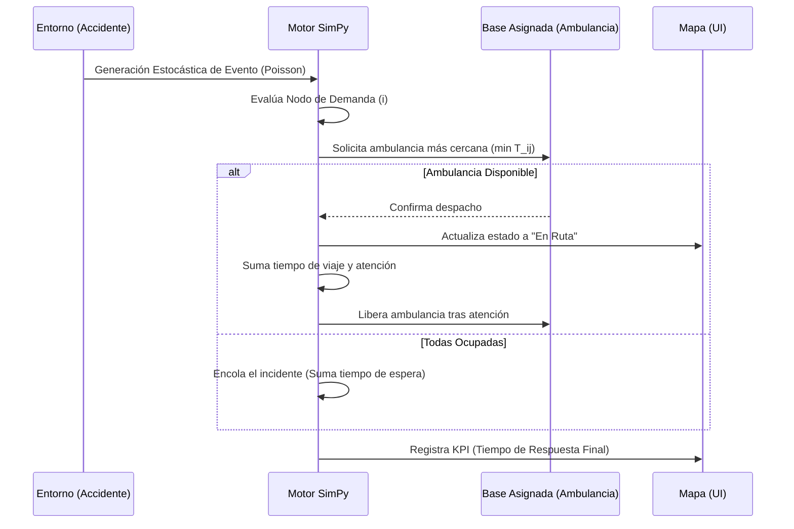

# Arquitectura del Sistema: Gemelo Digital de Ambulancias

Este documento presenta la arquitectura del sistema bajo rigurosidad científica, describiendo los componentes mediante diagramas de modelado estándar (UML y BPMN) implementados en Mermaid.js.

## 1. Diagrama de Casos de Uso (UML)

El diagrama de casos de uso describe las interacciones entre los actores del sistema (Operadores, Paramédicos, Modelos Analíticos) y las funciones principales del Gemelo Digital.

```mermaid
usecaseDiagram
    actor "Operador de Centro Regulador" as Op
    actor "Paramédico en Ruta" as Par
    actor "Modelo Analítico (Gemini/MILP)" as Mod

    package "Gemelo Digital APH" {
        usecase "Configurar Parámetros Globales" as UC1
        usecase "Visualizar Mapa de Calor (Accidentes)" as UC2
        usecase "Ejecutar Optimización MILP" as UC3
        usecase "Simular Eventos Discretos" as UC4
        usecase "Recibir Alerta de Despacho" as UC5
        usecase "Analizar Resultados y KPIs" as UC6
    }

    Op --> UC1
    Op --> UC2
    Op --> UC3
    Op --> UC4
    Op --> UC6

    Par --> UC5

    Mod --> UC3
    Mod --> UC4
    Mod --> UC6
```

## 2. Diagrama de Arquitectura de Componentes (UML)

La estructura computacional está diseñada como un sistema modular:

```mermaid
componentDiagram
    package "Capa de Presentación (Frontend)" {
        [Interfaz Web HTML/JS] as WebUI
        [Mapa Interactivo (Folium)] as Map
    }

    package "Capa de Lógica (Backend Python)" {
        [Controlador API Flask] as API
        [Motor de Simulación SimPy] as SimEngine
        [Optimizador MILP PuLP] as OptEngine
    }

    package "Capa de Datos" {
        database "Dataset Accidentes (CSV)" as DB_Acc
        database "Matriz Red Vial (OSMnx)" as DB_Net
    }

    WebUI <--> API : JSON / REST
    WebUI --> Map : Renderiza Iframe
    
    API --> OptEngine : Solicita Asignación
    API --> SimEngine : Solicita Simulación
    
    OptEngine --> DB_Net : Lee Tiempos (T_ij)
    SimEngine --> DB_Acc : Lee Frecuencias (Poisson)
```

## 3. Diagrama de Procesos de Negocio (BPMN)

Describe el flujo operativo desde que ocurre un accidente hasta que se atiende, comparando el estado AS-IS vs TO-BE.


